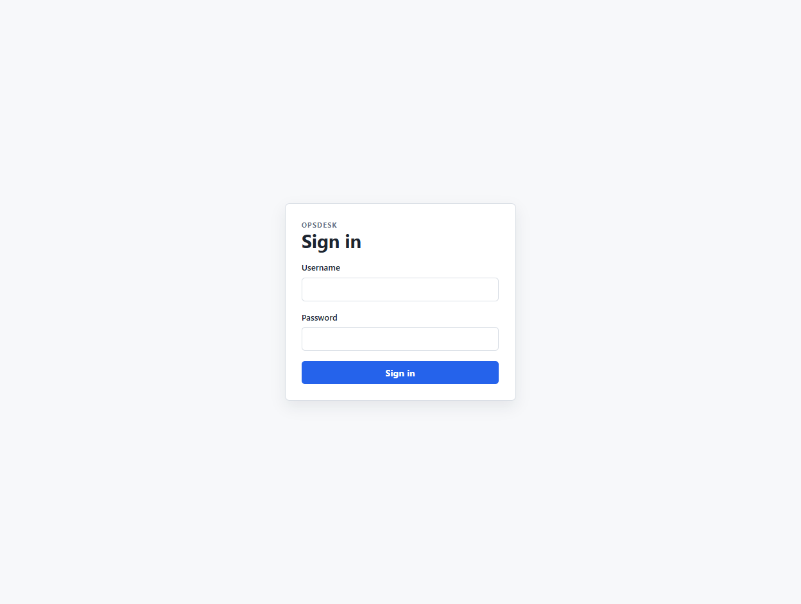
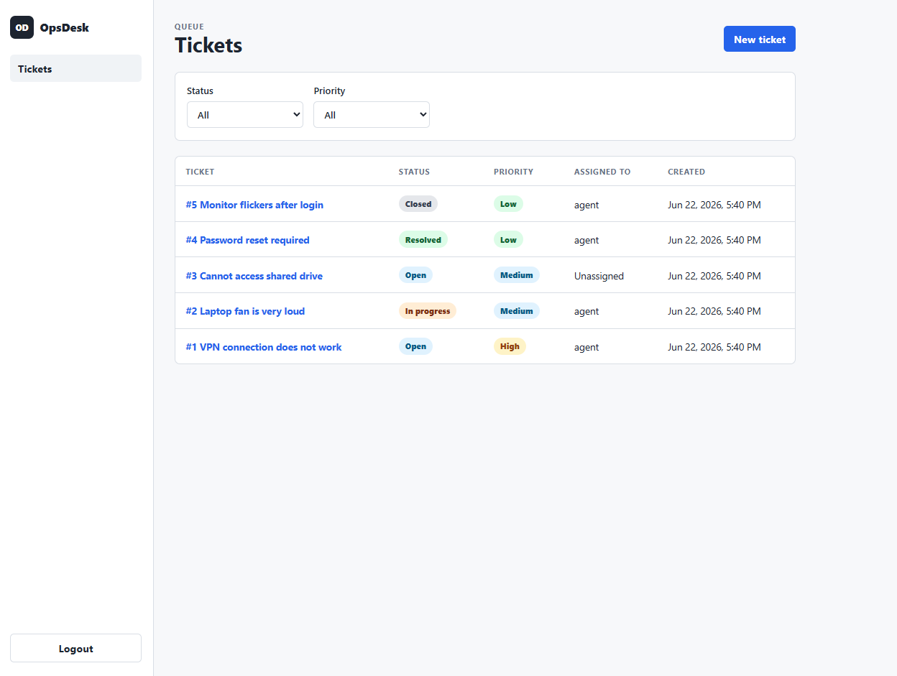
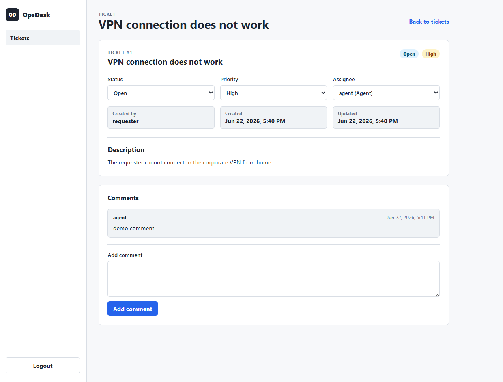
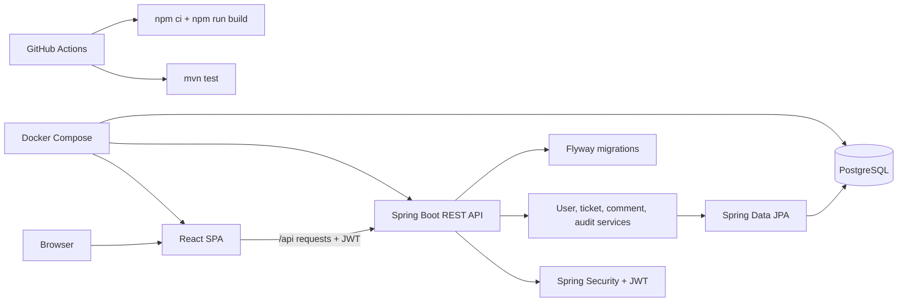

# OpsDesk 
# Java 21 · Spring Boot 3 · React · PostgreSQL · Docker · GitHub Actions


[](https://github.com/CipherRunner/OpsDesk/actions/workflows/release.yml)

[](https://github.com/CipherRunner/OpsDesk/actions/workflows/ci.yml)

## Project Overview

OpsDesk is a monolithic fullstack IT service desk application for managing support tickets in a small helpdesk workflow. The repository contains a Spring Boot backend, a React TypeScript frontend, PostgreSQL persistence, Docker Compose setup, automated backend tests, and a GitHub Actions CI workflow.

The application is intentionally kept as one project with two main application modules:

- `backend/` - Java Spring Boot REST API
- `frontend/` - React single-page application served by Vite in development and Nginx in Docker

## Main Features

- JWT login with protected frontend routes.
- Role model with `ADMIN`, `AGENT`, and `REQUESTER`.
- Demo users and demo tickets when demo data is enabled.
- Ticket creation for authenticated non-agent users.
- Ticket list with status and priority filters.
- Ticket detail view with status, priority, and assignee updates for admins and agents.
- Requester-scoped ticket visibility.
- Ticket comments.
- Ticket audit records for creation, status changes, priority changes, assignee changes, and comments.
- Flyway-managed database schema.
- Backend unit and integration tests, including PostgreSQL-backed integration tests with Testcontainers.

## Screenshots







## Tech Stack

### Backend

- Java 21
- Spring Boot 3.5
- Spring Web
- Spring Security with JWT bearer authentication
- Spring Data JPA
- PostgreSQL
- Flyway database migrations
- Maven wrapper
- JUnit, Mockito, AssertJ, MockMvc, and Testcontainers

### Frontend

- React 19
- TypeScript
- Vite
- React Router
- TanStack Query
- Axios
- ESLint

### DevOps

- Dockerfiles for backend and frontend
- Docker Compose with PostgreSQL, backend, and frontend services
- GitHub Actions CI

## Architecture Overview



## Roadmap
- [x] Docker Compose + CI pipeline
- [ ] Kubernetes (raw manifests, kind → AKS)
- [ ] Terraform (Azure AKS + Managed PostgreSQL)
- [ ] Full CI/CD pipeline (auto-deploy on push)
- [ ] Monitoring (Prometheus · Grafana · Loki)

### Repository Structure

```text
OpsDesk/
  backend/
    src/main/java/com/mark/opsdesk/
    src/main/resources/db/migration/
    src/test/java/com/mark/opsdesk/
    Dockerfile
    pom.xml
  frontend/
    src/
    public/
    Dockerfile
    package.json
    vite.config.ts
  .github/workflows/ci.yml
  docker-compose.yml
  .env.example
  README.md
```

## Local Development Setup

Prerequisites:

- Java 21
- Node.js 24 or another current Node.js version compatible with the frontend lockfile
- PostgreSQL for local backend development
- Docker if you want to run Testcontainers-based integration tests or the full Compose stack

Backend:

```bash
cd backend
./mvnw spring-boot:run
```

On Windows, use:

```powershell
cd backend
.\mvnw.cmd spring-boot:run
```

The default backend configuration reads PostgreSQL connection settings from environment variables and falls back to `jdbc:postgresql://localhost:5433/opsdesk` with username/password `opsdesk`. The `dev` profile uses `jdbc:postgresql://localhost:5432/opsdesk`.

Useful backend environment variables:

- `SPRING_DATASOURCE_URL`
- `SPRING_DATASOURCE_USERNAME`
- `SPRING_DATASOURCE_PASSWORD`
- `OPS_DESK_JWT_SECRET`
- `OPS_DESK_DEMO_DATA_ENABLED`

Frontend:

```bash
cd frontend
npm ci
npm run dev
```

The Vite dev server proxies `/api` requests to `http://localhost:8080`. The default Vite URL is `http://localhost:5173`.

## Docker Setup

Copy `.env.example` to `.env` if you want to override the default Docker Compose values.

Supported Compose variables from `.env.example`:

- `POSTGRES_DB`
- `POSTGRES_USER`
- `POSTGRES_PASSWORD`
- `OPS_DESK_JWT_SECRET`
- `FRONTEND_PORT`

```bash
docker compose up --build
```

The Compose stack starts:

- PostgreSQL database
- Backend API on `http://localhost:8080`
- Frontend on `http://localhost:3000` by default

The frontend container proxies `/api` to the backend container. Docker Compose enables demo data with `OPS_DESK_DEMO_DATA_ENABLED=true`.

## Deployment Preparation

Deployment preparation notes are documented in [docs/deployment.md](docs/deployment.md). The repository includes `docker-compose.prod.yml` as a minimal production-like reference for a single Docker host, but OpsDesk is not currently deployed by this repository.

For production-like runs, provide secrets such as `POSTGRES_PASSWORD` and `OPS_DESK_JWT_SECRET` through the deployment environment or an untracked env file. Do not commit real secrets, registry credentials, or cloud credentials.

## Example Demo Users

⚠️ Demo credentials only. Created when OPS_DESK_DEMO_DATA_ENABLED=true

Demo users are created by `DemoDataInitializer` when demo data is enabled.

| Username | Password | Role |
| --- | --- | --- |
| `admin` | `admin12345` | `ADMIN` |
| `agent` | `agent12345` | `AGENT` |
| `requester` | `requester12345` | `REQUESTER` |
| `otherrequester` | `otherrequester12345` | `REQUESTER` |

## API Overview

The API uses `/api` as its main prefix. Authenticated requests should send the JWT as a bearer token.

| Method | Endpoint | Notes |
| --- | --- | --- |
| `POST` | `/api/auth/login` | Login and receive a JWT plus current user data. |
| `GET` | `/api/me` | Return the authenticated user. |
| `GET` | `/api/users` | Admin-only user list. |
| `POST` | `/api/users` | Create users. The first user must be an admin; later user creation requires admin authorization. |
| `POST` | `/api/tickets` | Create a ticket. Agents are not allowed to create requester tickets. |
| `GET` | `/api/tickets` | Paginated ticket list with optional `status` and `priority` filters. Requesters only see their own tickets. |
| `GET` | `/api/tickets/{id}` | Ticket detail with requester ownership checks. |
| `PATCH` | `/api/tickets/{id}/status` | Admin/agent status update. |
| `PATCH` | `/api/tickets/{id}/priority` | Admin/agent priority update. |
| `PATCH` | `/api/tickets/{id}/assignee` | Admin/agent assignee update. |
| `GET` | `/api/tickets/{id}/comments` | List comments visible to the current user. |
| `POST` | `/api/tickets/{id}/comments` | Add a comment visible to the current user. |
| `GET` | `/api/tickets/{id}/audit` | List audit entries visible to the current user. |
| `GET` | `/actuator/health` | Public health endpoint. |
| `GET` | `/actuator/info` | Public info endpoint. |

Ticket statuses: `OPEN`, `IN_PROGRESS`, `RESOLVED`, `CLOSED`.

Ticket priorities: `LOW`, `MEDIUM`, `HIGH`, `URGENT`.

## Test Execution Commands

Backend tests:

```bash
cd backend
./mvnw test
```

On Windows:

```powershell
cd backend
.\mvnw.cmd test
```

The backend integration tests use Testcontainers with PostgreSQL, so Docker must be available for the integration test container.

Frontend build and lint:

```bash
cd frontend
npm ci
npm run build
npm run lint
```

There is no dedicated frontend test script in `frontend/package.json` at the moment.

## Getting Started
```bash
docker compose up --build
```

App available at: http://localhost:3000/login

Backend health check: http://localhost:8080/actuator/health

## CI/CD

GitHub Actions is configured in `.github/workflows/ci.yml` and runs on `push` and `pull_request`.

- Backend job: starts a PostgreSQL 16 service, sets up Java 21 with Temurin, caches Maven dependencies, and runs `mvn test` from `backend/`.
- Frontend job: sets up Node.js 24, uses the frontend `package-lock.json` for npm caching, runs `npm ci`, and runs `npm run build` from `frontend/`.

No deployment workflow is currently defined; the repository currently has CI coverage only.
